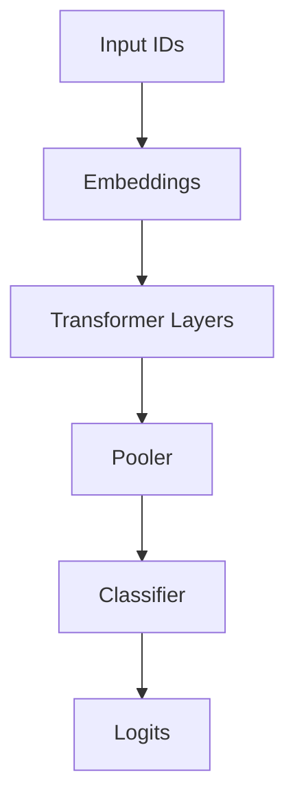
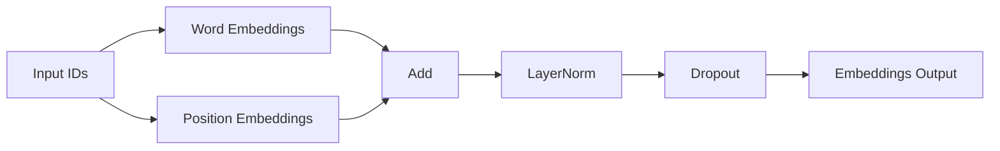
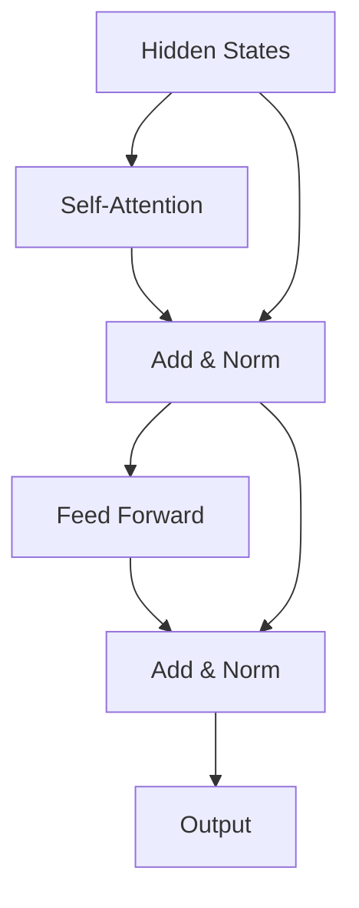
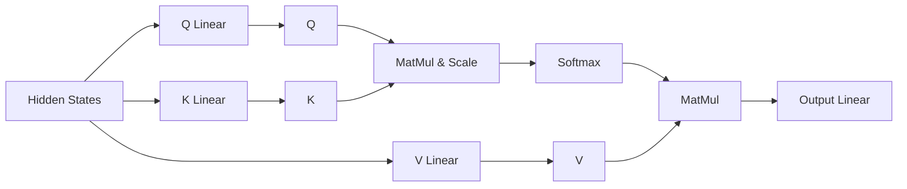
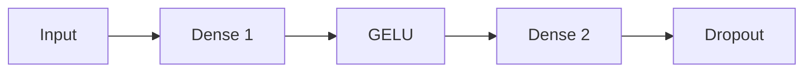
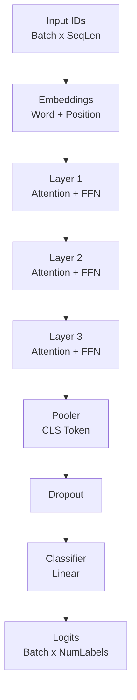
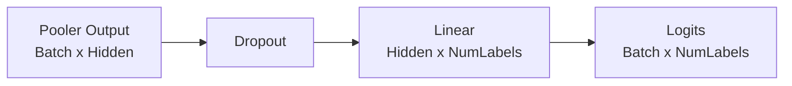

# Architecture

## Model Overview

## Embeddings Layer

## Transformer Encoder Layer

## Self-Attention Mechanism

## Feed Forward Network

## Full Model Architecture

## Classification Head

